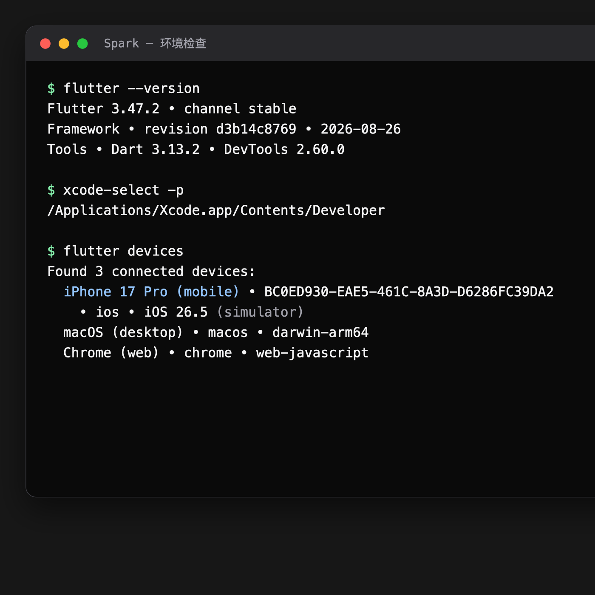

# 03｜搭建 macOS 与 iOS 开发环境

最后核验：2026-08-29

## 本篇结论

先把 Flutter、Xcode Command Line Tools 和 iOS Simulator 接通，再处理 Android 与鸿蒙。完成标准不是“软件装过了”，而是 `flutter doctor` 能识别工具链，`flutter devices` 能看到模拟器。

## 学完你能做到

- 安装并验证 Flutter stable。
- 配置 Xcode Command Line Tools。
- 启动 iOS Simulator，并让 Flutter 识别它。
- 读懂 `flutter doctor` 的问题范围。

## 开始前检查

你需要：

- 一台 Mac。
- 可用的网络连接。
- 足够安装 Xcode、Flutter SDK 和 Simulator Runtime 的磁盘空间。
- 当前 macOS 用户的管理员权限。

本篇只配置 iOS。Android Studio 与 DevEco Studio 会在后续章节分别处理。

## 01 安装 Xcode

通过 Mac App Store 或 Apple Developer 网站安装当前稳定版 Xcode。安装完成后先启动一次，让 Xcode 完成必要组件初始化。

然后配置命令行工具。Flutter 官方给出的命令是：

```bash
sudo sh -c 'xcode-select -s /Applications/Xcode.app/Contents/Developer && xcodebuild -runFirstLaunch'
```

这条命令会修改当前选中的 Xcode Developer Directory，并完成首次启动任务。执行前确认 Xcode 确实位于 `/Applications/Xcode.app`；如果安装在其他位置，需要替换路径。

检查结果：

```bash
xcode-select -p
```

预期输出类似：

```text
/Applications/Xcode.app/Contents/Developer
```

需要补充 iOS 平台与 Simulator Runtime 时，使用：

```bash
xcodebuild -downloadPlatform iOS
```

这一步下载量较大，执行时间取决于网络环境。

## 02 安装 Flutter stable

Flutter 官方提供两种安装方式：通过 VS Code 克隆 SDK，或者手动下载 SDK 压缩包。当前网络能稳定访问 GitHub 时，可以使用 VS Code；无法访问 GitHub 时，改用官方压缩包或 Flutter 官方文档列出的可信镜像。

官方入口：

- [Flutter 安装首页](https://docs.flutter.dev/install) 。
- [使用 VS Code 安装 Flutter](https://docs.flutter.dev/install/with-vs-code) 。
- [手动安装 Flutter SDK](https://docs.flutter.dev/install/manual) 。
- [Flutter SDK 历史版本下载](https://docs.flutter.dev/install/archive) 。

两种方式只选一种。不要先通过 VS Code 安装，再手动下载第二套 SDK，否则终端与编辑器可能指向不同版本。

### 方法一：通过 VS Code 安装（需要访问 GitHub）

先安装 [Visual Studio Code](https://code.visualstudio.com/download) ，然后按下面的步骤操作：

1. 启动 VS Code。
2. 安装 [Flutter 扩展](https://marketplace.visualstudio.com/items?itemName=Dart-Code.flutter) 。Flutter 扩展会同时安装 Dart 扩展。
3. 按 `Command + Shift + P` 打开命令面板。
4. 输入并选择 `Flutter: New Project`。
5. VS Code 询问 Flutter SDK 位置时，选择 `Download SDK`。
6. 选择一个长期保留、路径简单且当前用户可写的父目录，例如 `~/development`。
7. 点击 `Clone Flutter`，等待 SDK 下载完成。
8. 点击 `Add SDK to PATH`。
9. 关闭所有终端窗口并重启 VS Code，让新的 `PATH` 生效。

`Clone Flutter` 需要当前网络能够访问 GitHub。无法访问时，这条路径会停在克隆或下载阶段，应改用下面的手动下载方式，不要反复删除已经生成的目录。

这一步只是借助“新建项目”命令触发 SDK 安装。SDK 安装完成后可以先退出项目创建流程；第 04 课会统一创建课程项目。

验证：

```bash
flutter --version
```

如果命令能输出 Flutter、Engine、Dart 和 DevTools 的版本信息，说明 SDK 与 `PATH` 已经接通。

### 方法二：手动下载安装

打开 [Flutter 手动安装页面](https://docs.flutter.dev/install/manual) ，下载适合当前 Mac 架构的 stable SDK。Apple Silicon 机器选择 ARM64；Intel Mac 选择 x64。需要安装指定旧版本时，从 [Flutter SDK Archive](https://docs.flutter.dev/install/archive) 下载。

截至 2026-08-29，Flutter 官方 macOS 版本清单中的 stable 版本是 3.47.2。Apple Silicon 可以直接下载 [Flutter 3.47.2 stable ARM64](https://storage.googleapis.com/flutter_infra_release/releases/stable/macos/flutter_macos_arm64_3.47.2-stable.zip) ；该地址已验证返回官方 ZIP 文件。Intel Mac 不要使用这个 ARM64 压缩包。

如果 `storage.googleapis.com` 在当前网络中无法下载，可以按照 [Flutter 官方中国网络文档](https://docs.flutter.dev/community/china) 的说明，将下载地址中的域名替换为可信镜像域名。镜像可能存在同步延迟或版本缺失，下载后仍要核对文件名中的版本与架构。

Flutter 已开始逐步停止支持 Intel Mac。使用 Intel Mac 的读者应先在官方支持平台页面核对当前版本状态，不要默认最新版仍然提供 x64 构建。

把压缩包解压到一个长期保留、路径简单且当前用户可写的位置。不要放在临时目录，也不要放进需要管理员权限才能修改的系统目录。

假设 SDK 位于：

```text
/Users/your_name/development/flutter
```

在 `~/.zprofile` 加入：

```bash
export PATH="/Users/your_name/development/flutter/bin:$PATH"
```

把 `your_name` 和路径替换为真实值。保存后重新打开终端，或者在当前终端执行：

```bash
source ~/.zprofile
```

验证：

```bash
flutter --version
```

你应该看到 Flutter、Engine、Dart 和 DevTools 的版本信息。教程正式创建工程时会记录完整版本，不只记录 `stable`。

## 03 检查工具链

运行：

`flutter doctor -v` 在首次检查时可能继续获取 Dart 包或 Flutter 构建产物，需要可用的网络连接。没有配置其他可用下载路径时，先按 Flutter 官方中国网络文档在当前终端设置镜像：

```bash
export PUB_HOSTED_URL="https://pub.flutter-io.cn"
export FLUTTER_STORAGE_BASE_URL="https://storage.flutter-io.cn"
```

环境变量只对当前终端及其子进程生效。设置后在同一个终端运行：

```bash
flutter doctor -v
```

它会检查 Flutter SDK、Xcode、设备和其他可选平台工具。

本篇只要求：

- Flutter SDK 可用。
- Xcode 工具链可用。
- 能看到 iOS 相关环境。

Android toolchain 还没有配置时出现警告是预期现象，不要为了让所有标记立刻变绿而跳到后续章节。

如果命令持续超时，先根据报错中的域名判断是包源、构建产物源还是其他服务不可达，不要同时切换多个下载路径并清理缓存。

## 04 启动 iOS Simulator

Flutter 官方推荐新手先使用 Simulator，因为它比真机签名更容易建立第一个反馈闭环。

使用下面的命令启动：

```bash
open -a Simulator
```

然后检查 Flutter 能否发现设备：

```bash
flutter devices
```

预期结果中应该出现一台 iOS Simulator，并包含设备名称、设备 ID 和 iOS 版本。

示意输出：

```text
Found 1 connected device:
  iPhone ... (mobile) • <device-id> • ios • com.apple.CoreSimulator.SimRuntime.iOS-...
```

具体机型、ID 和系统版本取决于你的本机，不需要与示意内容完全相同。

下图汇总了本课验证环境中的实际命令输出：



图中使用 Flutter 3.47.2、Dart 3.13.2 和 iOS 26.5 iPhone 17 Pro Simulator。终端输出图只保留与本课检查目标直接相关的行。

## 05 CocoaPods 与 Swift Package Manager

从 Flutter 3.44 开始，Flutter 使用 Swift Package Manager 管理 iOS 与 macOS 原生依赖；CocoaPods 进入维护模式。不过 Flutter 的 iOS 环境指南仍要求为使用原生 iOS／macOS 代码的插件安装最新版 CocoaPods。

本篇先不安装 CocoaPods，因为首个无插件应用不依赖它。后续第一次引入需要 CocoaPods 的插件时，会依据当时的官方建议单独安装并验证，避免现在引入一个尚未使用的全局工具。

## 常见问题

### `flutter` 提示 command not found

如果通过 VS Code 安装，先完全退出并重新打开 VS Code 与终端。仍然无效时，根据 Flutter 扩展的 `Locate SDK` 提示重新选择刚下载的 `flutter` 目录。

如果通过手动方式安装，先检查 SDK 路径是否真实存在：

```bash
ls /Users/your_name/development/flutter/bin/flutter
```

再检查当前 shell 是否读到了路径：

```bash
which flutter
```

如果第一条存在而第二条没有输出，问题在 `PATH` 配置，不要重复下载 SDK。

### `xcode-select -p` 指向 CommandLineTools

如果输出是 `/Library/Developer/CommandLineTools`，说明当前选中的不是完整 Xcode。重新执行本篇配置 Xcode 的官方命令。

### `flutter devices` 看不到 Simulator

按顺序确认：

1. Simulator 窗口已经启动。
2. 模拟器设备已经完成开机，而不是停在创建或下载状态。
3. `xcode-select -p` 指向正确 Xcode。
4. 再运行一次 `flutter doctor -v` 查看具体诊断。

## 完成检查

- [ ] `flutter --version` 能输出完整版本。
- [ ] `xcode-select -p` 指向当前 Xcode。
- [ ] `flutter doctor -v` 能识别 Xcode。
- [ ] `flutter devices` 能看到 iOS Simulator。
- [ ] 我没有因为 Android 警告提前混装后续工具链。

## 一手来源

- [安装 Flutter](https://docs.flutter.dev/install) 。
- [使用 VS Code 安装 Flutter](https://docs.flutter.dev/install/with-vs-code) 。
- [手动安装 Flutter SDK](https://docs.flutter.dev/install/manual) 。
- [将 Flutter 添加到 PATH](https://docs.flutter.dev/install/add-to-path) 。
- [Flutter 支持平台与 Intel Mac 说明](https://docs.flutter.dev/reference/supported-platforms) 。
- [在中国网络环境下使用 Flutter](https://docs.flutter.dev/community/china) 。
- [Flutter 中文社区镜像说明](https://docs.flutter.cn/community/china/) 。
- [配置 iOS 开发环境](https://docs.flutter.dev/platform-integration/ios/setup) 。
- [Flutter CLI 参考](https://docs.flutter.dev/reference/flutter-cli) 。
- [Flutter 的 Swift Package Manager 说明](https://docs.flutter.dev/packages-and-plugins/swift-package-manager/for-app-developers) 。
