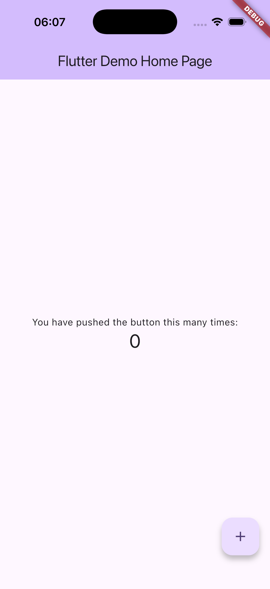
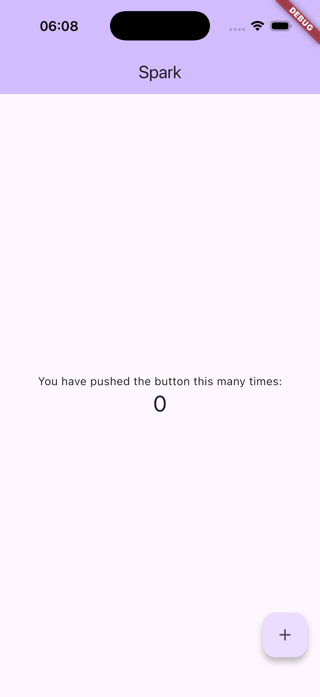
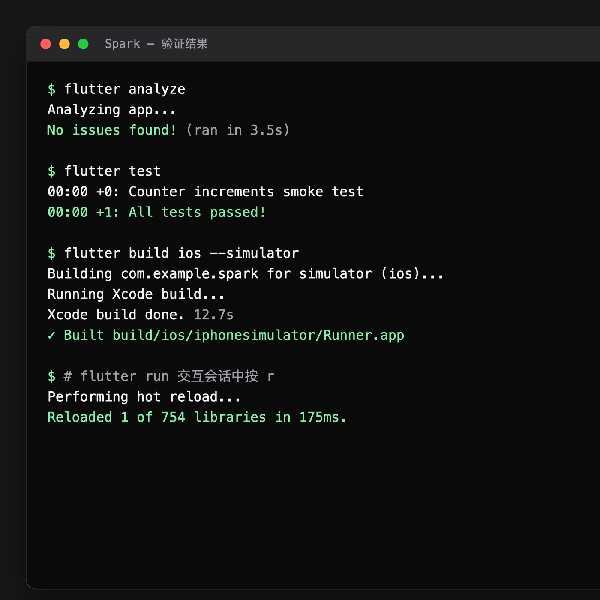

# 04｜运行第一个 iOS 应用

最后核验：2026-08-29

## 本篇结论

这一篇只完成一个闭环：创建项目、选中 iOS Simulator、运行应用、修改一处文字并看到热重载结果。做到这一步，才算开发环境真正可用。

## 学完你能做到

- 使用 Flutter CLI 创建一个只包含移动端的平台工程。
- 在指定 iOS Simulator 上运行应用。
- 区分热重载、热重启和完整重启。
- 使用 `flutter analyze` 和 `flutter test` 做第一次验证。

## 本篇验证环境

以下步骤已于 2026-08-29 在正式 `Spark` 工程中实际执行通过：

- macOS 26.5.2。
- Flutter 3.47.2 stable。
- Dart 3.13.2。
- Xcode 26.6。
- iOS 26.5 iPhone 17 Pro Simulator。

通过的命令包括：

```bash
flutter create --platforms=ios,android spark_app
flutter analyze
flutter test
flutter build ios --simulator
flutter run -d <device-id>
```

应用在 Simulator 启动后，终端热重载命令 `r` 执行成功。

## 01 创建练习项目

选择一个用于练习的父目录，然后运行：

`flutter create` 默认会解析项目依赖，首次运行和构建还可能下载 Dart 包与 Flutter 构建产物，因此需要可用的网络连接。如果第 03 课使用了镜像环境变量，请在同一个终端继续执行：

```bash
flutter create --platforms=ios,android spark_app
cd spark_app
```

当前暂时只生成 iOS 与 Android 工程。`ohos` 目录必须由匹配版本的 Flutter-OH 创建或补充，不能假设上游 Flutter 已经支持 `ohos` target。

查看顶层结构：

```bash
ls
```

你会看到类似内容：

```text
README.md
analysis_options.yaml
android
ios
lib
pubspec.yaml
test
```

现在只需要记住三个入口：

- `lib/main.dart`：Dart 应用入口。
- `pubspec.yaml`：项目元数据、SDK 约束、依赖和资源声明。
- `ios/`：iOS Runner 与 Xcode 配置。

## 02 选择 iOS Simulator

先确保 Simulator 已启动：

```bash
open -a Simulator
```

列出设备：

```bash
flutter devices
```

如果同时连接了多个设备，复制目标 Simulator 的设备 ID，然后明确指定：

```bash
flutter run -d <device-id>
```

不要把尖括号原样输入。把 `<device-id>` 替换成 `flutter devices` 输出的真实 ID。

首次运行会完成依赖解析、iOS 构建和安装，通常比之后慢。成功后，终端会进入交互状态，Simulator 显示 Flutter 默认计数器页面。



## 03 完成第一次热重载

打开 `lib/main.dart`，找到下面这行：

```dart
home: const MyHomePage(title: 'Flutter Demo Home Page'),
```

将模拟器中可见的页面标题改成：

```dart
home: const MyHomePage(title: 'Spark'),
```

保存文件。如果编辑器已启用保存时热重载，Simulator 会自动更新；否则在运行 `flutter run` 的终端按：

```text
r
```

预期结果：

- 终端出现 reload 完成信息。
- Simulator 中对应文字发生变化。
- 计数器等当前状态通常不会因为热重载被清空。



## 04 热重载、热重启与完整重启

三种操作解决的问题不同：

| 操作 | `flutter run` 按键 | 保留应用状态 | 典型用途 |
|---|---|---|---|
| 热重载 | `r` | 通常保留 | 修改 Widget 构建和普通 Dart 代码 |
| 热重启 | `R` | 不保留 | 需要重新执行 `main()` 和初始化逻辑 |
| 完整重启 | 退出后重新运行 | 不保留 | 修改原生工程、依赖或构建配置 |

热重载不是“所有改动立刻生效”。修改 `ios/` 原生代码、增加插件或更改某些初始化流程后，应完整重启。

## 05 看懂运行终端

`flutter run` 期间常用操作：

```text
r  Hot reload
R  Hot restart
h  List commands
q  Quit
```

如果应用出现异常，先看终端中的第一段错误和堆栈，不要只看 Simulator 上的红屏摘要。完整堆栈通常包含文件名、行号和真实失败原因。

## 06 做第一次静态分析和测试

退出运行进程后执行：

```bash
flutter analyze
flutter test
```

预期结果分别类似：

```text
No issues found!
```

```text
All tests passed!
```

默认项目自带一个 Widget 测试。此时不要求理解测试代码，只需要建立习惯：界面能打开不是唯一完成标准，静态分析和自动测试也要通过。

再验证一次 iOS 模拟器构建：

```bash
flutter build ios --simulator
```

这一步验证项目能在不依赖当前调试会话的情况下完成 Simulator 构建。

下图汇总了正式 `Spark` 工程本次实际执行的分析、测试、构建和热重载输出：



## 07 本篇暂时不改什么

不要急着做以下操作：

- 不删除默认计数器页面。
- 不引入状态管理库。
- 不修改 Bundle Identifier 和签名。
- 不安装数据库、网络或 UI 组件依赖。
- 不手工创建 `ohos` 目录。

下一阶段会先解释项目结构和工具链边界，再把默认应用逐步改造成 `Spark`。

## 常见问题

### `flutter run` 选错了设备

先运行 `flutter devices`，然后使用 `flutter run -d <device-id>` 明确指定，不要依赖自动选择。

### 修改后热重载没有变化

确认文件已保存、终端仍处于 `flutter run` 会话，并尝试按大写 `R` 热重启。如果修改涉及原生工程或依赖，退出后重新运行。

### `flutter test` 因找不到原来的文字而失败

默认 Widget 测试检查计数器的 `0` 和 `1`，本篇只修改 `MyHomePage` 的标题，不会改变这些测试预期。如果你继续修改了计数器数字、按钮或测试依赖的其他内容，需要同步理解并更新测试。

### iOS 构建卡在首次下载

首次运行可能需要下载构建产物。保留完整终端输出，先确认是持续下载还是已经出现网络错误；如果错误指向包或构建产物下载源，回到 [第 03 课](03-macos-ios-setup.md) 的 Flutter 安装与镜像配置步骤检查，不要反复中断并重新开始。

## 完成检查

- [ ] `flutter run -d <device-id>` 能在 iOS Simulator 启动应用。
- [ ] 将 `Flutter Demo Home Page` 改为 `Spark` 后，能通过热重载在 Simulator 中看到变化。
- [ ] 我能解释 `r`、`R` 和完整重启的区别。
- [ ] `flutter analyze` 通过。
- [ ] `flutter test` 通过。
- [ ] `flutter build ios --simulator` 通过。

## 一手来源

- [Flutter CLI 参考](https://docs.flutter.dev/reference/flutter-cli) 。
- [配置 iOS 开发环境](https://docs.flutter.dev/platform-integration/ios/setup) 。
- [Flutter iOS 平台文档](https://docs.flutter.dev/platform-integration/ios) 。
