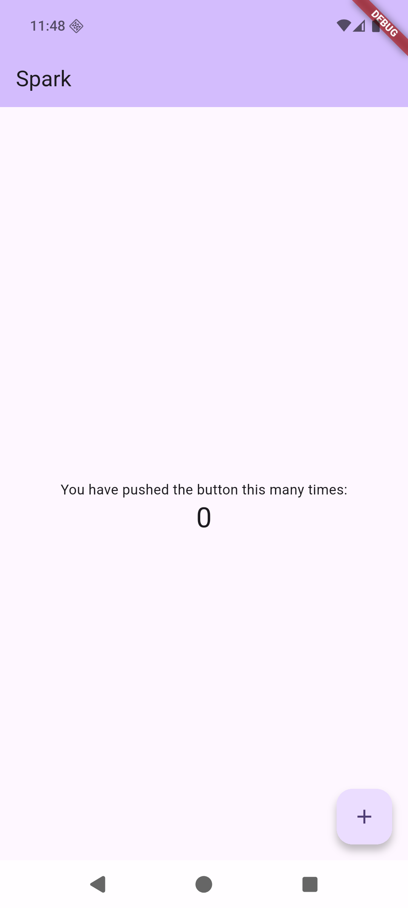

# 06｜看懂 Android Studio、Android SDK、模拟器与构建流程差异

最后核验：2026-09-04

## 本篇结论

Android Studio 只是开发入口之一，不等于完整的 Android 工具链。Flutter 面向 Android 运行或构建时，还会依赖 Android SDK、JDK、Gradle、Android Gradle Plugin、设备或模拟器；这些组件与 iOS 的 Xcode、Simulator 和构建系统并不是逐项等价的替换关系。

本篇在不安装新工具、不修改 Gradle 或签名配置的前提下，使用现有 Android 16 模拟器跑通 `Spark` 的环境检查、安装、启动、交互、热重载、debug APK 和 release AAB 构建。AAB 当前使用模板调试密钥，只能证明 release 打包链路可用，不能用于正式发布。

## 学完你能做到

- 区分 Android Studio、Flutter 插件、Flutter SDK 和 Android SDK。
- 解释 SDK Platform、Build-Tools、Platform-Tools、Command-line Tools、Emulator 与系统镜像的职责。
- 区分 AVD 配置和 Android Emulator 运行实例。
- 说清 Flutter、Gradle、Android Gradle Plugin 和 JDK 如何参与 Android 构建。
- 区分 APK 与 AAB，不把 Google Play 的要求套用到所有中国大陆 Android 渠道。
- 用明确设备 ID 运行 `Spark`，并验证页面、交互和热重载。
- 构建 debug APK 与 release AAB，同时识别签名验证边界。
- 遇到下载失败时，先判断失败的是 Flutter、Android SDK、Gradle 还是 Maven 依赖。

## 本篇核验边界

2026-09-04 重新核对 Flutter 3.47.2 对应的 Android 环境、构建发布与热重载文档，以及 Android Developers 的 AVD 和 AGP 资料，并完成以下本机验证：

| 项目 | 本机结果 |
|---|---|
| Flutter／Dart | Flutter 3.47.2 stable／Dart 3.13.2 |
| Android Studio／JDK | Android Studio 2026.1／内置 OpenJDK 25.0.2 |
| Android SDK | SDK 37.0.0；项目实际使用 `compileSdk 36`、`targetSdk 36`、`minSdk 24` |
| Android 构建链 | 已安装 Build-Tools 36.0.0／37.0.0；项目使用 NDK 28.2.13676358、AGP 9.1.0、Gradle 9.3.1 |
| 模拟器 | `PocketUtils_API_36`，Android 16（API 36），ARM64，硬件加速正常 |
| 工具链检查 | `flutter doctor -v` 的 Android toolchain 通过，Android SDK 许可证全部接受 |
| 应用验证 | 安装与启动成功，标题为 `Spark`，计数从 `0` 变为 `1`，真实源码热重载与恢复均成功 |
| 构建验证 | debug APK 成功；release AAB 成功，但仍使用模板调试密钥 |

本篇没有验证 Android Studio Flutter 插件的图形操作、从零创建 AVD、Android 真机、无 GMS 厂商环境、正式发布签名或任何应用商店上传流程。

## 开始前检查

你需要已经读完第 05 课，并能在 iOS Simulator 中运行 `Spark`。本篇继续使用现有 `app/` 工程；Android Studio 用于确认 SDK 与启动 AVD，代码编辑仍可在 VS Code 完成。

在 VS Code Explorer 中展开 `app/android/`。只查看文件，不修改 Gradle、SDK、JDK、签名或环境变量配置。

## 01 不要把 Android Studio 当成全部工具链

Flutter 官方明确说明：只安装 Android Studio 的 Flutter 插件并不够，仍然需要 Flutter SDK；要面向 Android 运行，还需要 Android SDK 和对应工具。

各层职责如下：

| 组件 | 负责什么 | 与 iOS 学习路径的主要差异 |
|---|---|---|
| Android Studio | 编辑器，以及 SDK Manager、Device Manager、Gradle 等工具的图形入口 | Xcode 同时承担 Apple 平台 IDE 和构建工具入口；Android Studio 本身不等于 Android SDK |
| Flutter 插件 | 让 Android Studio 识别 Flutter 工程，提供 Dart 分析、运行、调试和 Inspector 入口 | 类似第 05 课的 VS Code Flutter 扩展，但不能代替 Flutter SDK |
| Flutter SDK | 提供 `flutter` 命令、Flutter Framework 和构建协调逻辑 | iOS 与 Android 共用上游 Flutter SDK |
| Android SDK | 提供 Android 平台 API、构建工具、设备通信和模拟器相关工具 | 不由 Xcode 管理，需要单独通过 Android SDK 工具管理 |
| JDK | 运行 Gradle，并参与 Java／Kotlin 构建 | iOS 构建不经过 JVM 与 Gradle |
| Gradle 与 AGP | 读取构建脚本并完成 Android 专用编译、打包和变体配置 | 对应的是 Android 构建链，不应当作 Xcode 工程文件的同名替代品 |

你仍然可以用 VS Code 编写 Flutter 代码。是否使用 Android Studio 作为日常编辑器，与 Android SDK、JDK 和 Gradle 是否齐全，是两个问题。

## 02 Android SDK 不是一个单独文件

Flutter 官方 Android 环境说明要求通过 SDK Manager 管理平台和工具。主要组件的职责不同：

| SDK 组件 | 作用 | 缺失时影响 |
|---|---|---|
| SDK Platform | 提供某个 Android API Level 的平台 API | 无法针对相应平台编译 |
| SDK Build-Tools | 包含打包、签名分析等构建工具 | Gradle 无法完成部分构建步骤 |
| SDK Command-line Tools | 提供 SDK 包管理和许可证相关命令 | 命令行管理 SDK 受阻 |
| SDK Platform-Tools | 包含 `adb` 等设备通信工具 | 无法正常识别、安装或调试设备上的应用 |
| Android Emulator | 运行虚拟 Android 设备 | 不能在本机启动 Android 虚拟设备 |
| System Image | AVD 实际启动的 Android 系统 | 只有 Emulator 程序也无法创建可启动设备 |
| CMake 与 NDK | 构建原生 C／C++ 代码 | 使用相关原生插件或工程时可能无法构建 |

不要看到一个“Android SDK 已安装”提示，就默认所有平台、工具和系统镜像都齐全。SDK Platform、Build-Tools、Emulator 和 System Image 是不同下载项。

本课程当前 Flutter 3.47.2 模板实际使用 `compileSdk 36`、`targetSdk 36`、`minSdk 24`，本机也安装了对应 Platform 与 Build-Tools。这里记录的是当前可复现基线，不是要求读者手工把数字改到一致；实际项目需要同时考虑 Flutter 模板、Android Gradle Plugin 兼容范围，以及三个 SDK 数值的用途，只追求数字最大并不能证明工具链兼容。

## 03 AVD 与 Emulator 不是同一个概念

Android 官方将 AVD 定义为虚拟设备配置，其中包含硬件规格、系统镜像、存储和其他属性。Android Emulator 则读取这份配置，启动一个可交互的虚拟设备实例。

对应关系可以这样理解：

```text
Device Manager 创建和管理 AVD
              ↓
AVD 指定硬件配置与 System Image
              ↓
Android Emulator 启动这个虚拟设备
              ↓
adb 与 Flutter 工具识别运行中的设备
```

iOS Simulator 通常由 Xcode 统一提供运行时与设备管理入口；Android 需要分别关注 Emulator 程序、AVD 配置和 System Image。删除其中一层，另外两层仍可能存在。

带 Google Play 标识的 AVD 系统镜像可以包含 Play Store 和 Google Play 服务，但这不代表中国大陆常见真机默认具备同样环境。课程后续说明 Android 差异时，不会用一台带 GMS 的模拟器代表所有大陆设备。

## 04 Android 构建多了一条 Gradle 链路

Flutter 的 Android 构建不是 Android Studio 直接把 Dart 文件变成 APK。整体关系是：

```text
Dart 与 Flutter 资源
        ↓
Flutter 构建工具
        ↓
项目中的 Gradle Wrapper
        ↓
Gradle + Android Gradle Plugin + JDK
        ↓
Android SDK Build-Tools
        ↓
APK 或 AAB
```

Gradle、Android Gradle Plugin、JDK 和 Android SDK 之间存在版本兼容关系。更新 Android Studio 后出现同步提示，不代表应该把每个项目的 AGP 或 Gradle 一并升级到最高版本；应先核对 Flutter 模板和 Android 官方兼容表，再决定是否修改工程。

与第 04 课的 iOS 路径对比：

| 阶段 | iOS | Android |
|---|---|---|
| 原生工程入口 | `ios/Runner.xcworkspace` 或 Xcode 工程 | `android/` Gradle 工程 |
| 构建系统 | Xcode Build System | Gradle + AGP |
| 本机虚拟设备 | iOS Simulator | AVD + Android Emulator |
| 调试安装包 | Simulator 中的 `.app` | 可安装的 debug APK |
| 发布准备 | Archive、签名与 App Store 流程 | release 签名，以及 APK 或 AAB |

## 05 APK 与 AAB 解决的问题不同

APK 是可以安装到 Android 设备上的应用包。AAB 是发布包，商店或配套工具会根据设备配置生成要交付的 APK。

Flutter 官方发布文档给出两条构建入口：

| 目的 | Flutter 命令 | 产物含义 |
|---|---|---|
| 构建调试 APK | `flutter build apk --debug` | 生成可安装的 debug APK |
| 构建 App Bundle | `flutter build appbundle` | 生成 release AAB |

两条命令均已在当前 `Spark` 工程执行成功，产物分别位于 `build/app/outputs/flutter-apk/app-debug.apk` 和 `build/app/outputs/bundle/release/app-release.aab`。构建目录是本地产物，不提交到 Git；产物大小会随 Flutter Engine、ABI、资源和构建模式变化，不把本机大小写成固定标准。

Google Play 推荐 AAB，但这不是所有 Android 分发渠道的统一规则。面向中国大陆发布时，需要逐个核对目标应用商店当时的官方包格式、签名和上架要求，不能默认 Google Play 流程等于国内渠道流程。

调试签名也不等于发布签名。当前 `android/app/build.gradle.kts` 的 release 变体仍明确引用 `signingConfigs.getByName("debug")`，所以本次 AAB 成功只验证 release 编译和打包，不证明发布签名已经配置。正式发布需要单独配置并保护签名材料，密钥和密码不得进入 Git。

## 06 只读认识 `app/android/`

现在在 Explorer 中依次找到这些文件：

| 路径 | 当前课程中先记住什么 |
|---|---|
| `android/settings.gradle.kts` | 声明插件、插件仓库和 `:app` 模块 |
| `android/build.gradle.kts` | Android 工程级仓库与公共构建配置 |
| `android/app/build.gradle.kts` | 应用 ID、SDK 范围、构建类型和 Flutter Gradle 插件入口 |
| `android/gradle/wrapper/gradle-wrapper.properties` | 固定项目使用的 Gradle 发行版 |
| `android/app/src/main/AndroidManifest.xml` | 声明应用组件、权限和平台元数据 |
| `android/app/src/main/kotlin/.../MainActivity.kt` | Android 原生入口 |
| `android/app/src/main/res/` | 图标、启动背景和 Android 原生资源 |

你可能还会在本机看到 `android/local.properties`。它记录本机 SDK 路径等局部信息，不应作为团队通用配置提交。课程不会要求你手工复制别人的 `local.properties` 来“修复”路径。

这一步只确认每类文件负责什么，不修改版本号，也不触发 Gradle Sync。

## 07 完成 Android 验证闭环

先在 `app/` 中检查工具链和设备：

```bash
flutter doctor -v
flutter emulators
flutter devices
```

`flutter doctor -v` 的 Android toolchain 应通过；启动 AVD 后，`flutter devices` 至少应出现一个 platform 为 `android` 的设备。不要只看到 AVD 名称就认为设备已经运行。

然后使用实际输出中的设备 ID 运行应用：

```bash
flutter run -d <device_id>
```

当前机器的 ID 是 `emulator-5554`，这是本次运行实例的临时标识，读者不能原样照抄。应用启动后确认标题为 `Spark`、计数初始为 `0`，点击右下角加号后变为 `1`。




验证热重载时，临时把 `lib/main.dart` 的标题改为 `Spark Android`，在运行终端按 `r`。标题变化且终端出现 `Reloaded 1 of ... libraries` 后，再恢复为 `Spark` 并再次热重载。不要把临时标题留在正式源码中。

最后停止调试会话，执行：

```bash
flutter analyze
flutter test
flutter build apk --debug
flutter build appbundle
```

这些命令分别验证共享代码、Widget 测试、debug APK 构建和 release AAB 打包。它们不能互相替代，也不能证明发布签名或应用商店审核已经完成。

各命令检查的层级如下：

| 命令 | 检查对象 |
|---|---|
| `flutter doctor` | Flutter 所见的 Android toolchain 与 Android Studio 状态 |
| `flutter doctor --android-licenses` | 阅读并接受已安装 Android SDK 的许可证 |
| `flutter emulators` | Flutter 能发现的模拟器配置 |
| `flutter devices` | Flutter 能发现的已运行模拟器或已连接设备 |
| `flutter run -d <device_id>` | 在明确设备上运行应用 |
| `flutter build apk --debug` | 构建可安装的 debug APK |
| `flutter build appbundle` | 进入 AAB 构建流程 |

本篇已实际执行除许可证交互外的上述验证命令；`flutter doctor -v` 同时确认本机许可证全部接受。命令的意义仍是定位不同层级，不要把所有失败都归为“Flutter 没装好”。

## 08 中国大陆网络环境要分清下载源

Android 首次配置可能同时访问多个来源：

- Android Studio 安装包与插件市场。
- Android SDK Platform、Build-Tools、Emulator 和 System Image。
- Gradle 发行包。
- Google Maven、Maven Central 等依赖仓库。
- Flutter SDK 构建产物与 pub 包。

Flutter 官方中国网络文档列出的镜像覆盖 Flutter SDK、Flutter 构建产物和 pub 包。它没有把 Android SDK、系统镜像、Gradle 发行包或全部 Maven 依赖声明为同一镜像的覆盖范围。

因此，设置 `PUB_HOSTED_URL` 或 `FLUTTER_STORAGE_BASE_URL` 后 Android SDK 仍下载失败，并不矛盾。应先从失败日志确认具体 URL 和组件，再使用对应维护方的官方渠道或组织批准的网络方案；不要从来源不明的下载站拼装 SDK、Gradle 或系统镜像。

## 预期结果

完成本篇后，应该得到以下可核对结果：

- 能画出 Android Studio、Flutter SDK、Android SDK、Gradle／AGP 与设备之间的关系。
- 能指出 AVD 是配置，Emulator 是运行程序，System Image 是虚拟系统。
- 能在 `app/android/` 中找到主要构建文件，并解释各自职责。
- 能根据失败发生的位置区分 Flutter 镜像、SDK 下载、Gradle 下载和 Maven 依赖问题。
- `flutter devices` 能识别一个运行中的 Android 设备。
- `Spark` 能安装、启动，且计数交互与真实源码热重载生效。
- debug APK 与 release AAB 构建成功，同时知道当前 AAB 仍不是正式签名发布包。

## 常见问题

### 安装 Android Studio 后，Android 环境就完整了吗

不一定。还要看 Android SDK 的平台与工具组件、JDK、许可证，以及设备或 AVD 是否齐全。Flutter 插件和 Flutter SDK 也需要分别确认。

### 只用 VS Code，可以开发 Flutter Android 吗

可以把 VS Code 作为编辑器，但底层仍需要 Android SDK、JDK、Gradle 和设备工具。更换编辑器不会消除 Android 工具链依赖。

### AVD 已经创建，为什么还没有设备

AVD 只是配置。只有 Android Emulator 使用该配置成功启动后，Flutter 和 `adb` 才可能把它识别为运行中的设备。

### 为什么不能直接升级 AGP 和 Gradle

两者与 Android Studio、JDK、SDK 以及 Flutter 模板存在兼容关系。只按更新提示追到最高版本，可能让原本可构建的工程失去兼容性。

### Flutter 镜像能解决 Android SDK 下载失败吗

不能直接这样推断。Flutter 官方镜像文档明确覆盖 Flutter SDK、构建产物和 pub 包，没有承诺覆盖 Android SDK、系统镜像、Gradle 与所有 Maven 仓库。

### APK 和 AAB 应该选哪个

取决于分发目标。APK 可以直接安装；AAB 用于交给支持 App Bundle 的分发渠道生成设备 APK。Google Play 偏好 AAB，中国大陆渠道需要逐个查看其当前官方要求。

## 完成检查

- [ ] 我能区分 Android Studio、Flutter 插件、Flutter SDK 和 Android SDK。
- [ ] 我知道 Android SDK 各组件不是一次下载得到的单一文件。
- [ ] 我能解释 AVD、Emulator 和 System Image 的关系。
- [ ] 我能说清 Gradle、AGP、JDK 和 SDK Build-Tools 在构建链中的位置。
- [ ] 我能区分 APK 与 AAB。
- [ ] `flutter doctor -v` 的 Android toolchain 通过，许可证状态正常。
- [ ] `flutter devices` 能识别我实际启动的 Android 设备。
- [ ] `Spark` 能运行，计数从 `0` 变为 `1`，标题修改可以热重载并恢复。
- [ ] `flutter analyze`、`flutter test`、debug APK 和 release AAB 构建全部通过。
- [ ] 我知道当前 AAB 使用模板调试密钥，不能直接用于正式发布。

## 一手来源

- [Flutter 官方 Android 开发环境说明](https://docs.flutter.dev/platform-integration/android/setup) 。
- [Flutter 官方 Android Studio 与 IntelliJ 使用指南](https://docs.flutter.dev/tools/android-studio) 。
- [Android Developers：创建和管理虚拟设备](https://developer.android.com/studio/run/managing-avds) 。
- [Android Developers：Android 构建配置](https://developer.android.com/build) 。
- [Android Developers：Android Gradle Plugin 说明与兼容关系](https://developer.android.com/build/releases/about-agp) 。
- [Android Developers：构建工具与依赖关系](https://developer.android.com/build/tool-and-library-dependencies) 。
- [Flutter 官方 Android 构建与发布说明](https://docs.flutter.dev/deployment/android) 。
- [Flutter 官方中国网络环境说明](https://docs.flutter.dev/community/china) 。
